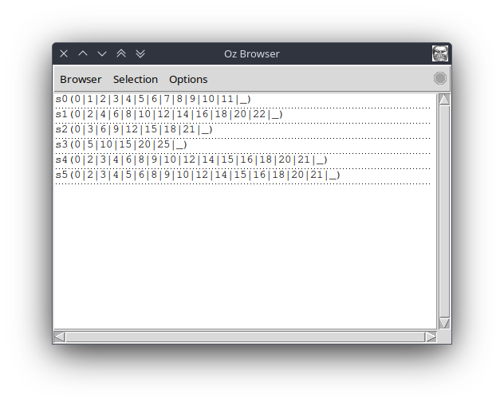
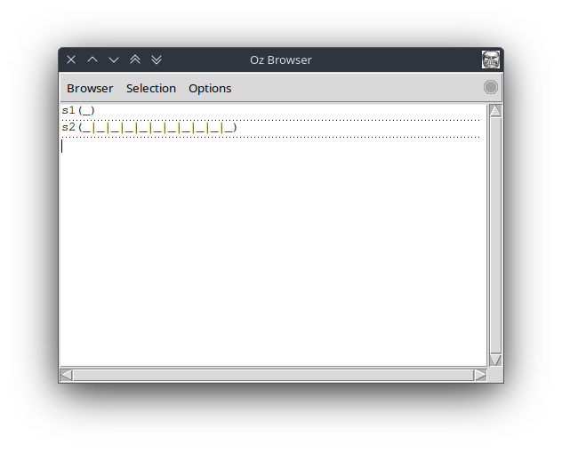
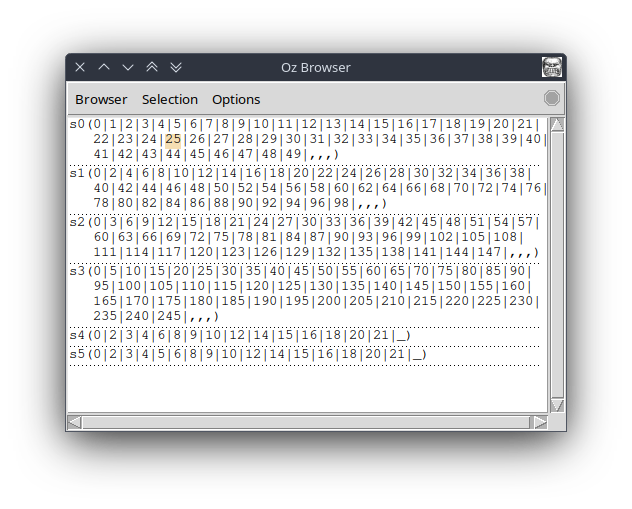
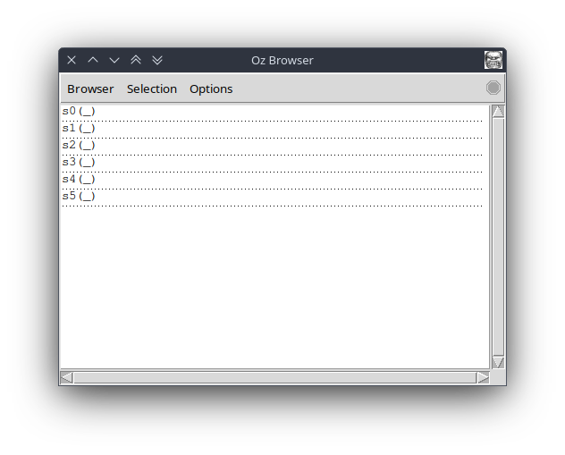
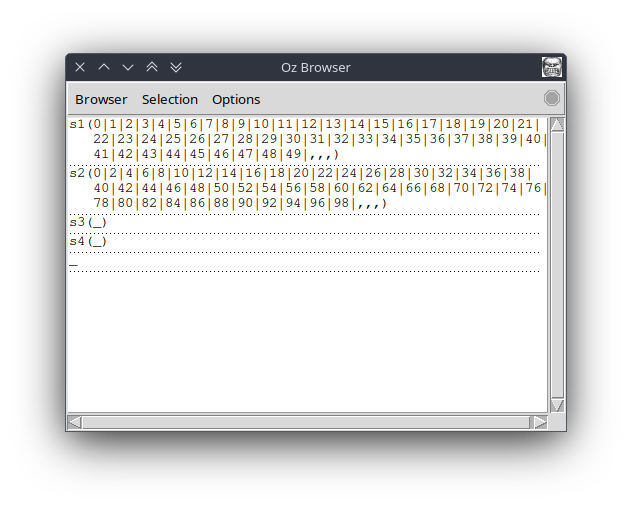

# Hamming problem

The hamming problem has 7 agents where each one is a running thread : one stream generator, three stream multipliers, two mergers and one consumer at the end.
Threads are linked to each other by lazy and dataflow links. The consumer wants to consume an element it will trigger a signal to the mergers then they forward it to the multipliers that finally forward it to the generator. At this point all of them (excluding the generator) are waiting on the above agent in chain needed chain to respond. Once the generator produced an element, it will unblock the multipliers for one run then these unblock the mergers that finally unblock the consumer. The hamming problem as classic lazy/dataflow problems is a production chain with responsibilities delegation.

See an example below for 16 asked elements.



The point of this analyze is to find interesting bugs to debug with the debugger later. Both normal and kernel versions are analyzed.

## Times

Times procedure multiplying all elements of a stream by N.
Other procedures are not parsed because the principle is the same.

```oz
fun lazy {Times L N}
    case L of H|T then
        H*N|{Times T N}
    end
end
```

It generates a new thread at each recursion.
We want the thread blocking on the need for the next element and producing this element when needed if and only if the next input element is available.

```oz
proc {Times InStream N ?OutStream}
    thread
        {WaitNeeded OutStream}
        local NewOutStream in
            {Wait InStream}
            local Value in
                Value = InStream.1 * N
                OutStream = Value|NewOutStream
            end
            {Times InStream.2 N NewOutStream}
        end
    end
end
```

### Thread overuse

#### Kernel code

In this version, the student has put the dataflow waiting into a thread so now the Times agents will not wait the generator to produce elements and will certainly give unbound elements to the mergers.

This bug is very annoying to detect as the Merge agents are behaving properly they will not accept unbound values and wait on it (see Merge code) and it will compensate the lack for waiting of the Times agents. Thus if the code is run in the normal setup, where Times are controlled by Merges the prompts are correct and consistent exactly like the prompt [here](#hamming-problem).

```oz
proc {Times InStream N ?OutStream}
    thread
        {WaitNeeded OutStream}
        local NewOutStream in
            local Value Next in
                thread % Thread overuse
                    {Wait InStream}
                    Value = InStream.1 * N
                    Next = InStream.2
                end
                OutStream = Value|NewOutStream
                {Times Next N NewOutStream}
            end
        end
    end
end
```

However if we test directly the Times function alone we directly notice there is a problem. To do so we craft the below calls where the generated stream is unbound but the elements are needed and see on the browser that something is wrong.

```oz
{Browser.browse s0(S0)}
{Browser.browse s1(S1)}
S0 = _
{Times S0 2 S1}
{Touch S1 10}
```


The procedure Times has produced a stream of unbound elements thus it did not wait the generator as expected.

This bug is very annoying because in a normal context everything seems to happen correctly and gave a correct prompt. For the point of view of the debugger, it is a valid program without technical problems. The matter here is conceptual, there are no lazy or dataflow inconsistencies but a bad algorithm.

If the debugger is able to show dynamic variables updates as the browser does and the user test each procedure separately it would work. It could be nice if the debugger proposed a mode to execute procedure separately and test random inputs on it and to display or check the output. The user has just to specify which type of inputs the procedure takes here a stream, a constant integer and an unbound variable as output, then the debugger test different kinds of input streams, constants and check if unbound stuff is found from the stream (stream unbound or unbound elements) then reports a warning to the user. However doing it seems more to be a testing tool.

#### Normal code

Now if the user still mistakes with higher-level OZ code the bug can be harder to reproduce. In the below code, the user overuses a thread for the result `H*N` however thanks to the `case L of H|T` the `{Wait L}` is done so the program will behave normally even with this useless thread. The debugger could detect seeing the byte code that H and N are always assigned at this point (if we assume N is bound).

```oz
fun lazy {Times L N}
    case L of H|T then % Harder to because case wait on it
        thread H*N end|{Times T N}
    end
end
```

However with a less cleaner code using directly the stream as a list record the user is able to re-do the thread overuse and recreate the bug with the same conditions than the kernel code.

```oz
fun lazy {Times L N}
    thread L.1 * N end|{Times thread L.2 end N}
end
```

Using this trigger code else again the Merge agents prevent the bug to be visible.

```oz
{Browser.browse s1(S1)}
{Browser.browse s2(S2)}
S1 = _ % {GenerateIncrementalStream}
S2 = {Times S1 2}
{Touch S2 10}
```

And the prompt is as below.



#### Solution

Thread overuse inside an agent that is in the middle of a production chain can have its lack of waiting corrected by the next waiting thread that will first wait on the unbound values received by it and finally the program will give good final results because only some intermediate states were inconsistent.

This kind of bug if not manually targeted can be silent as we saw the only way to detect the anomaly was to test directly the Times procedure.

The debugger could tell which kind of thread provide the Merge thread and the user would see this is not Times threads directly that unblock Merge threads but if the user is conceptually mistaken the problem that might be not enough evident.

### Forgot lazy suspension

The student could accidentally to make a lazy suspension even by not calling `{WaitNeeded OutputStream}` or forgetting to declare the function as lazy.

#### Kernel code

##### Forgotten lazy suspension

When writing kernel code a such error can easily happen and is easily viewable. The Times agents will not be patient and will ask the generator to produce elements as soon as possible.

```oz
proc {Times InStream N ?OutStream}
    thread
        % {WaitNeeded OutStream} % Oups
        local NewOutStream in
            {Wait InStream}
            local Value in
                Value = InStream.1 * N
                OutStream = Value|NewOutStream
            end
            {Times InStream.2 N NewOutStream}
        end
    end
end
```

If we display intermediate states we see the final state evolving incrementally on need but the intermediate state that are unsynchronized for example Times 2 should have a bigger stream than Times 3 and 5.



##### Forgotten lazy thread

An other interesting case is if the student forgets the create a new thread for each call to the lazy procedure. In this case, the Main thread will run the Times procedure and it will block other agents to be created. The result is quite visible nothing happens because Touch that is normally executed by Main will never be reached. 

```oz
proc {Times InStream N ?OutStream}
    % thread % Oups
        {WaitNeeded OutStream}
        local NewOutStream in
            {Wait InStream}
            local Value in
                Value = InStream.1 * N
                OutStream = Value|NewOutStream
            end
            {Times InStream.2 N NewOutStream}
        end
    % end
end
```



#### Normal code

For a missing lazy declaration the problem is different but visible too. The lazy declaration does not add only a `{WaitNeeded OutStream}` call but also a thread generation at each call. So now, we have the first Times call that does not produce a thread and is run by the Main thread blocking all other agents to be create, and also it tries to produce an infinite number of elements. We see the stream of Times 2 that is full on startup and a while later the program crash for a memory problem that is expected as the streams cannot have infinite sizes.

```oz
fun {Times L N}
    case L of H|T then
        H*N|{Times T N}
    end
end
```



```sh
$ ozengine Prog.ozf 
FATAL: The active memory (732096609) after a GC is over the maximal heap size threshold: 732096600
Terminated VM 1
```

In this context, it is more a forgotten lazy declaration is both a forgotten lazy thread and suspension.

#### Solution

A simple solution is to show to the user what kinds of thread (kind = code in OZ program) are currently running and the user will see Touch for example is never reached and the Main thread (ex id 0) is running into the Times procedure that is not normal.
